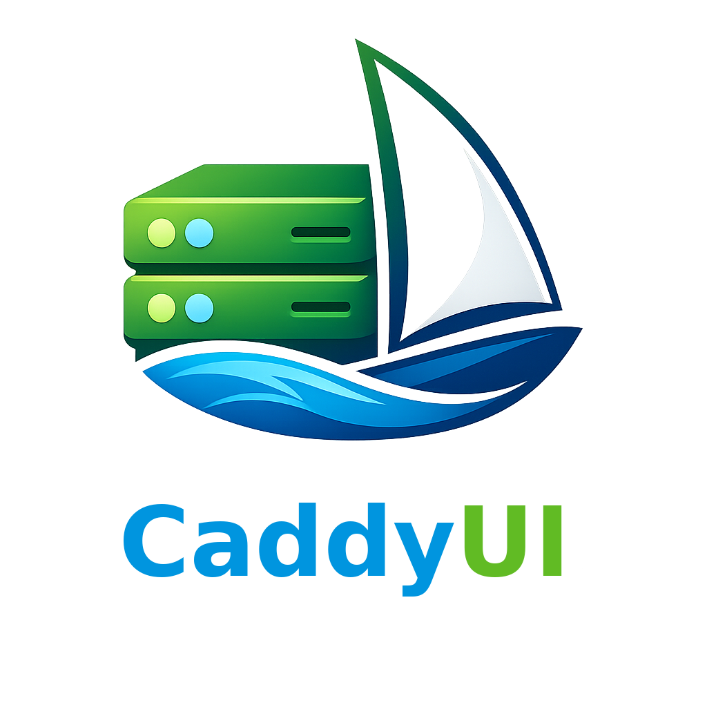
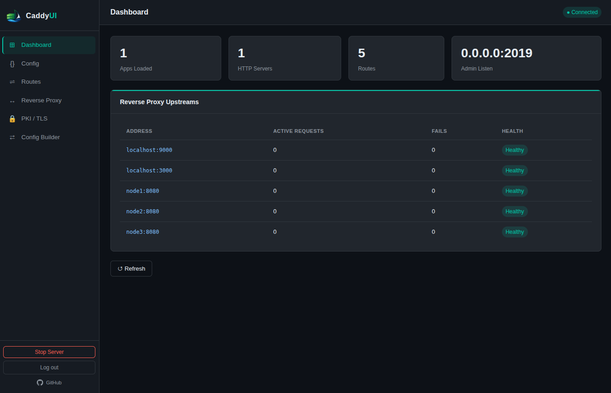
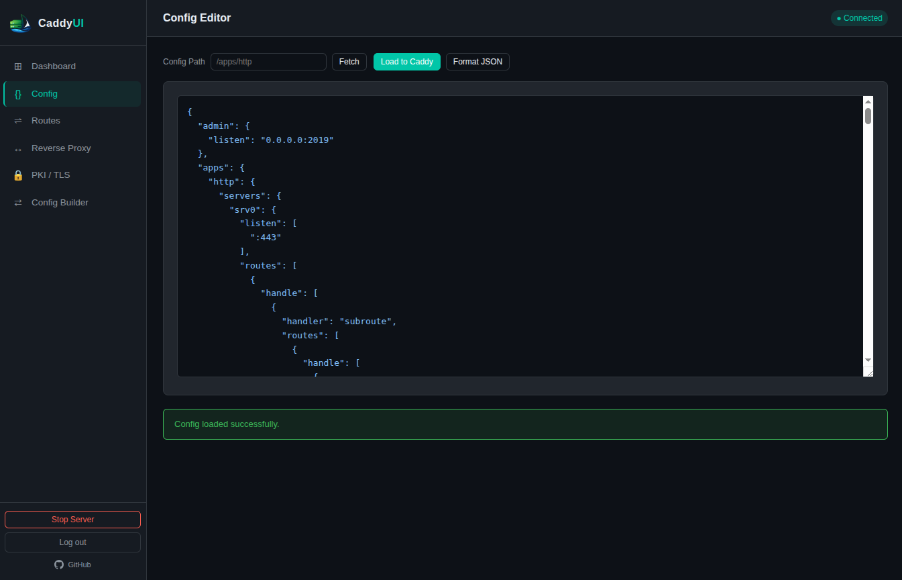
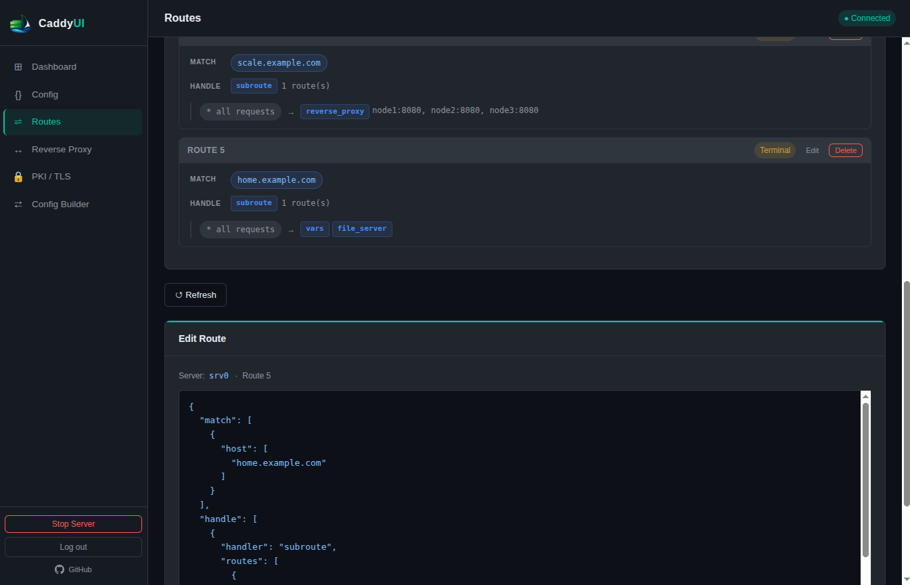
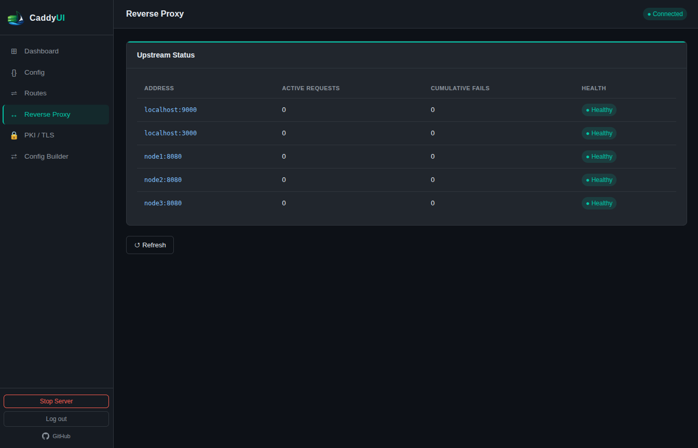
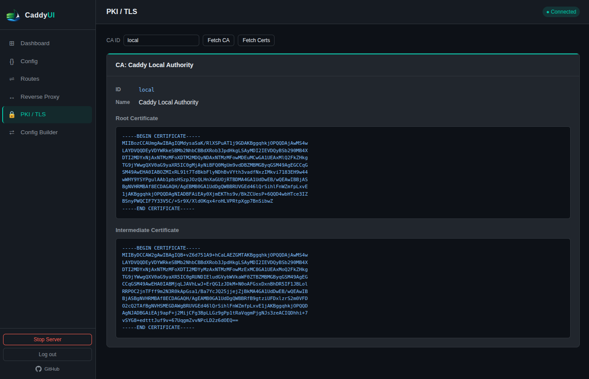
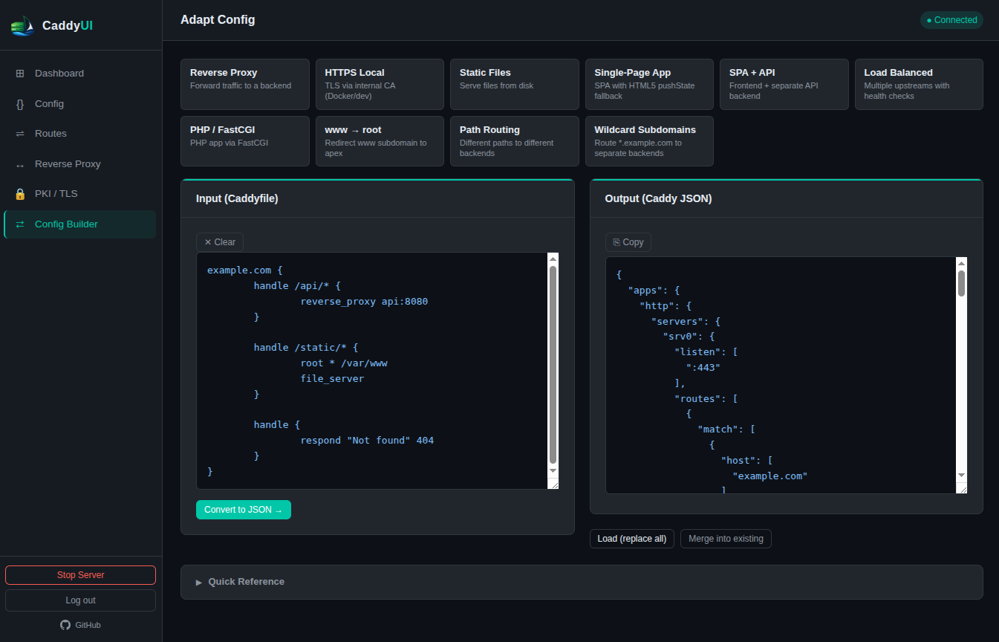

<p align="center">
  
</p>

<p align="center">
  A lightweight web interface for the <a href="https://caddyserver.com">Caddy</a> REST admin API.<br/>
  Configure sites, reverse proxies, TLS, and more — no Caddyfile editing required.
</p>

<p align="center">
  Built with Go, <a href="https://templ.guide">templ</a>, and <a href="https://data-star.dev">Data-Star</a>
  &nbsp;·&nbsp;
  <a href="https://github.com/Missions21-Ecosystems/caddyui">GitHub</a>
</p>

---

## Screenshots

| Dashboard | Config |
|---|---|
|  |  |

| Routes | Reverse Proxy |
|---|---|
|  |  |

| PKI / TLS | Config Builder |
|---|---|
|  |  |

---

## Getting Started

### Prerequisites

- [Docker](https://docs.docker.com/get-docker/) and [Docker Compose](https://docs.docker.com/compose/)

### 1. Clone and configure

```sh
git clone <your-repo-url> caddyui
cd caddyui
cp .env.example .env
```

Edit `.env` to set your admin credentials:

```env
UI_USERNAME=admin
UI_PASSWORD=yourpassword
```

> **Note:** `CADDY_ADMIN_URL` in `.env` is used when running the UI binary directly on your host. When using Docker Compose, the UI always connects to the bundled Caddy container at `http://caddy:2019` regardless of this value.

### 2. Start

```sh
docker compose up --build
```

| Service | URL |
|---|---|
| Caddy UI | http://localhost:8080 |
| Caddy (HTTP) | http://localhost:80 |
| Caddy admin API | http://localhost:2019 |

Log in with the credentials from your `.env`.

---

## Setting Up a Reverse Proxy

The easiest way to configure Caddy is via the **Config Builder** page, which converts a plain Caddyfile into the JSON format Caddy loads. It includes a template library — click any card to populate the editor.

### Step 1 — Write a Caddyfile snippet

Open the UI at **http://localhost:8080** → **Config Builder** in the sidebar.

Paste this into the editor, replacing the address and upstream with your values:

```
:80 {
    reverse_proxy localhost:3000
}
```

To proxy a named host instead:

```
app.example.com {
    reverse_proxy localhost:3000
}
```

> **Docker:** If the service you're proxying runs on the host machine (not inside Docker), use `host.docker.internal` instead of `localhost`:
> ```
> app.example.com {
>     reverse_proxy host.docker.internal:3000
> }
> ```
> If it's another Docker Compose service, use the service name: `myapp:3000`.

### Step 2 — Convert and load

1. Click **Convert to JSON →** — the equivalent Caddy JSON appears on the right.
2. Choose how to apply it:

| Button | Behaviour |
|---|---|
| **Load (replace all)** | Replaces the entire running config with the converted JSON |
| **Merge into existing** | Appends new servers/routes onto the current config without removing anything |

> **Merge behaviour:** if the adapted config produces a server with the same name as an existing one (Caddy typically calls them `srv0`, `srv1`, etc.), its routes are **appended** rather than replaced. Use the **Routes** page to remove duplicates if needed.

### Step 3 — Verify

Go to **Dashboard** → the reverse proxy upstream will appear in the **Upstream Status** table. Go to **Routes** to see the configured server and route, and edit or delete routes directly from there.

---

## Serving Static Files

### Step 1 — Place your files

Static files are served from the `./site` directory, which is mounted into the Caddy container at `/srv`.

```sh
echo '<h1>Hello!</h1>' > site/index.html
```

### Step 2 — Write the Caddyfile

In **Config Builder**, paste:

```
:80 {
    root * /srv
    file_server
}
```

### Step 3 — Convert and load

Click **Convert to JSON →** then **Load (replace all)** or **Merge into existing**.

Your files are now live at **http://localhost**.

---

## Combining Proxy and Static Files

```
:80 {
    handle /api/* {
        reverse_proxy localhost:3000
    }

    handle {
        root * /srv
        file_server
    }
}
```

Paste in **Config Builder**, convert, and load. Routes are matched top to bottom within each server block.

---

## HTTPS with a Local CA

For local or Docker-internal HTTPS using Caddy's built-in CA:

```
localhost {
    tls internal
    reverse_proxy host.docker.internal:8080
}
```

Caddy generates and signs the certificate automatically. Trust the CA in your browser via **PKI / TLS** → copy the root certificate → import it into your OS/browser trust store.

---

## HTTP Basic Auth

Passwords must be bcrypt-hashed. Generate one using the Caddy container:

```sh
docker exec -it caddyui-caddy-1 caddy hash-password --plaintext "yourpassword"
```

Then add `basic_auth` to your site block:

```
example.com {
    basic_auth {
        alice $2a$14$Zkx19XLiW6VYouLHR5NmfOFU0z2GTNmpkqzwQITVtyhazoP27oB9C
    }
    reverse_proxy localhost:3000
}
```

To protect only a specific path:

```
example.com {
    basic_auth /admin/* {
        alice $2a$14$...
    }
    reverse_proxy localhost:3000
}
```

---

## Active Health Checks

By default Caddy only marks an upstream unhealthy after real traffic fails through it (passive). To get proactive health checking, add an `active` health check block:

```
reverse_proxy backend:8080 {
    health_uri     /healthz
    health_interval 15s
    health_timeout  5s
}
```

Caddy will poll `/healthz` every 15 seconds and mark the upstream down immediately if it fails, regardless of whether traffic is flowing.

---

## UI Pages

| Page | What it does |
|---|---|
| **Dashboard** | Caddy connectivity, loaded apps, upstream status |
| **Config** | Fetch and edit the raw JSON config; load it back into Caddy |
| **Routes** | View HTTP servers and routes; edit or delete routes in place |
| **Reverse Proxy** | Live upstream table with request and failure counts |
| **PKI / TLS** | View CA info and certificate chains |
| **Config Builder** | Convert a Caddyfile to Caddy JSON using templates or your own input, then load in one step |

The **Stop Server** button in the sidebar sends `POST /stop` to gracefully shut Caddy down. There is no corresponding Start — once stopped, Caddy must be restarted through whatever process manager or shell controls it (e.g. `docker compose restart caddy`). Use with caution on remote servers.

---

## Environment Variables

| Variable | Default | Description |
|---|---|---|
| `CADDY_ADMIN_URL` | `http://localhost:2019` | Caddy admin API URL (local/standalone use) |
| `LISTEN_ADDR` | `:8080` | Address the UI listens on |
| `UI_USERNAME` | `admin` | Basic auth username |
| `UI_PASSWORD` | `changeme` | Basic auth password |
| `BASE_PATH` | _(empty)_ | Browser-side path prefix when proxied under a sub-path (e.g. `/admin`) |

---

## Running Without Docker

Requires Go 1.25+ and the `templ` CLI.

```sh
go install github.com/a-h/templ/cmd/templ@v0.3.1020

cp .env.example .env   # point CADDY_ADMIN_URL at your Caddy instance
templ generate
go run ./cmd/
```

The UI will be available at `http://localhost:8080`.

---

## Development

```sh
# Regenerate templates after editing any .templ file
templ generate

# Build the binary
go build -o caddyui ./cmd/

# Build the Docker image
docker build -t caddyui .
```
